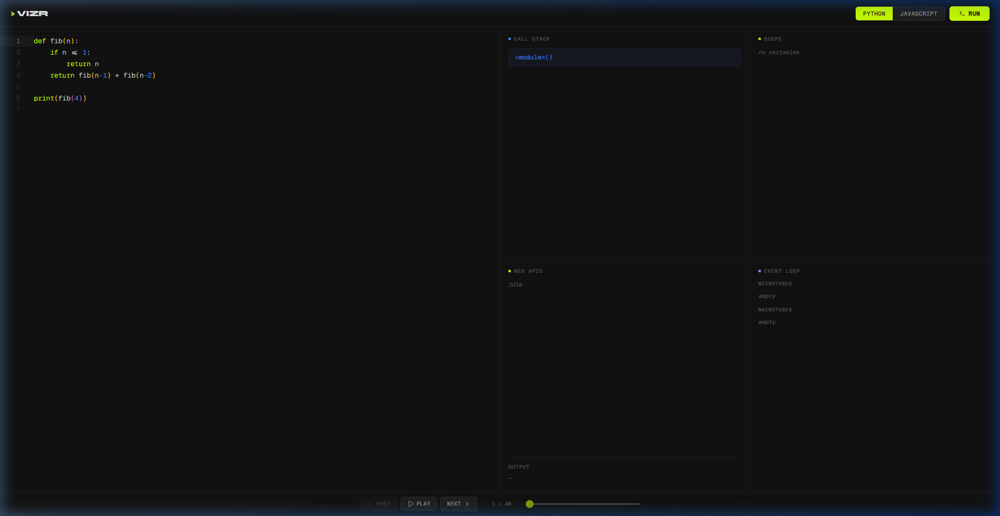
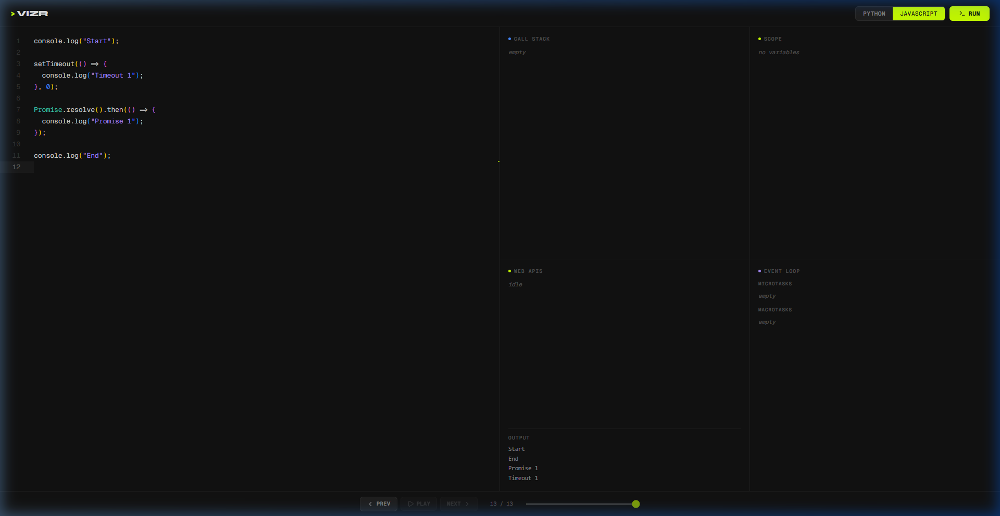

# > vizr — Code Visualizer

A minimal, production-grade **Python & JavaScript** code execution visualizer. Paste code, hit run, and step through execution line-by-line with animated panels for the **Call Stack**, **Scope**, **Web APIs**, and **Event Loop Queues**.


---

## Features

- **Python tracing** — powered by `sys.settrace`, captures every call, return, and line event
- **JavaScript tracing** — client-side AST instrumentation with simulated Event Loop, Microtask & Macrotask queues
- **Step-by-step controls** — Prev / Play / Pause / Next with auto-advance
- **Live panels** — Call Stack, Variable Scope, Web APIs, Microtask Queue, Macrotask Queue, Console Output
- **Monaco Editor** — full syntax highlighting, custom dark theme with lime accents

---

## Screenshots

### Python — Fibonacci Trace



### JavaScript — Event Loop



---

## Tech Stack

| Layer         | Tech                                    |
| ------------- | --------------------------------------- |
| Frontend      | React + TypeScript + Vite               |
| Editor        | Monaco Editor                           |
| Animations    | Framer Motion                           |
| Backend       | Python FastAPI                          |
| Python Tracer | `sys.settrace`                          |
| JS Tracer     | Acorn AST + custom Event Loop simulator |

---

## Getting Started

### Prerequisites

- Node.js 18+
- Python 3.10+

### Install & Run

```bash
# Backend
cd backend
python -m venv venv
.\venv\Scripts\activate      # Windows
pip install -r requirements.txt
python run.py

# Frontend (new terminal)
cd frontend
npm install
npm run dev
```

Open **http://localhost:5173** in your browser.

---

## Project Structure

```
├── backend/
│   ├── main.py              # FastAPI + Python tracer
│   ├── run.py               # Uvicorn entry point
│   └── requirements.txt
├── frontend/
│   ├── src/
│   │   ├── App.tsx           # Main app layout & state
│   │   ├── index.css         # Minimal dark theme
│   │   ├── components/
│   │   │   ├── CodeEditor.tsx
│   │   │   └── Visualizer.tsx
│   │   └── lib/
│   │       └── jsTracer.ts   # Client-side JS execution engine
│   └── package.json
├── preview.webp
├── preview-python.png
├── preview-js.png
└── README.md
```

---

## License

MIT
